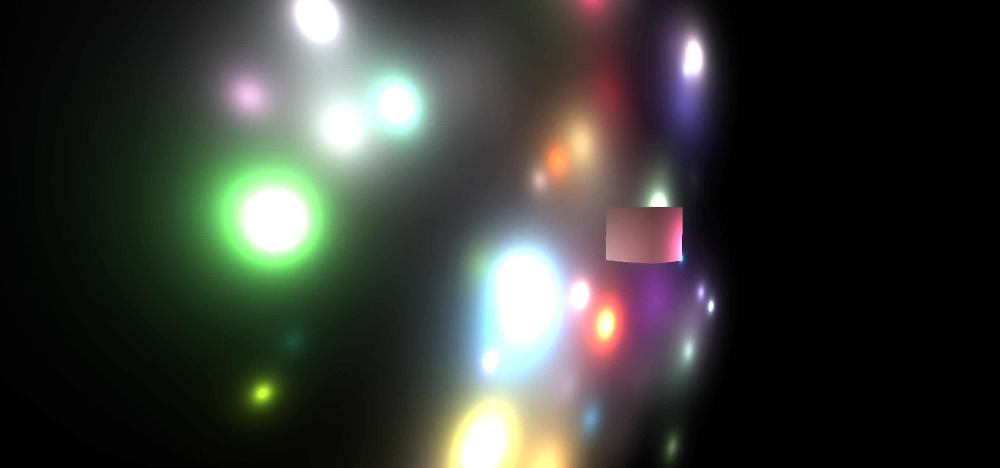
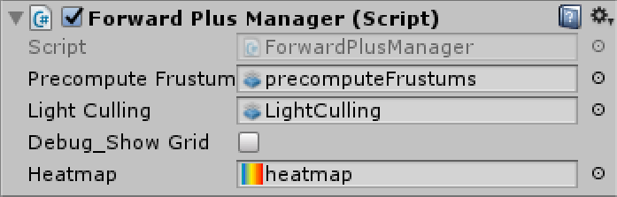
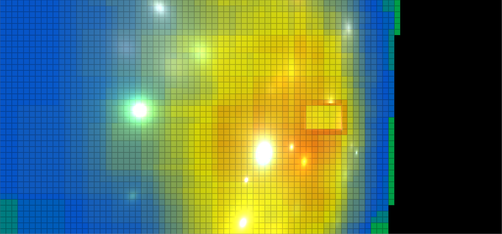

# Unity Forward+ System

  

# Overview
Implementation of a **Forward+** (tiled forward) system for Unity, based on this article: https://www.3dgep.com/forward-plus/

# Usage

  

 - Add the component **Forward Plus Manager** to the camera
 - Fill the fields **Precompute Frustums** and **Light Culling** with their corrisponding compute shaders from the folder `Assets/ForwardPlus/Shaders/`
 - Add a texture in the **Heatmap** field, try with `Assets/Demo/Textures/heatmap.png`
 - The field **Debug_ShowGrid** is a toggle to  enable the visualization of the lights grid with an heatmap for the most populated tiles

  

To write a shader you need:
- Declare this resources:
  - `Texture2D<uint2> g_lightsGrid`
  - `Buffer<uint> g_lightsIndexBuffer`
  - `StructuredBuffer<Light> g_lights `
 - In the fragment shader compute the tile coordinate, and use it to read from the `g_lightsGrid`. The x component is the number is the start offset in the buffer `g_lightsIndexBuffer` and the y component is the number of lights for the tile.
 - Cycle for the number of lights and read first the index from `g_lightsIndexBuffer` and use it to get the light data from the buffer `g_lights`

There is an example diffuse shader in the folder  `Assets/Demo/Shaders/`

## Further Development
- Right now only point lights are supported, next i'll implement directional and spot
- Allow dynamically movable lights
- Make the system working also in the editor and not only in play mode

## License
This project is licensed under the MIT License - see the [LICENSE](LICENSE)
